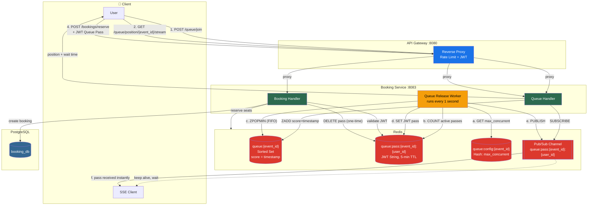
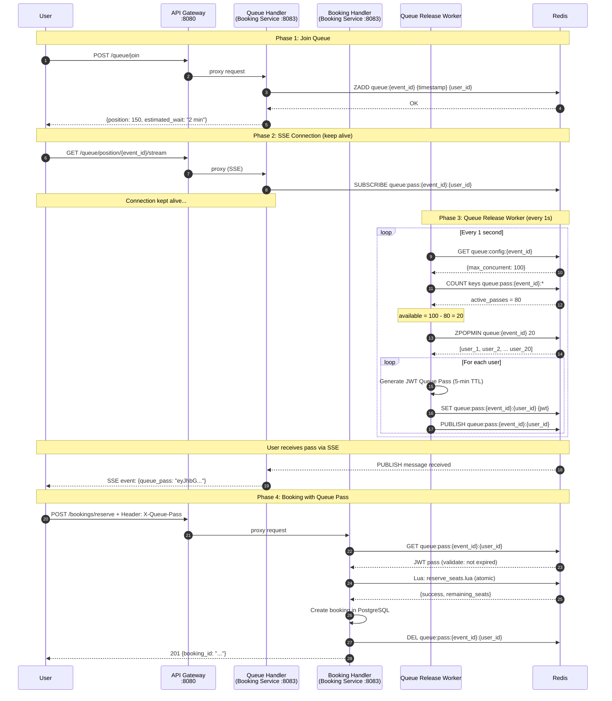
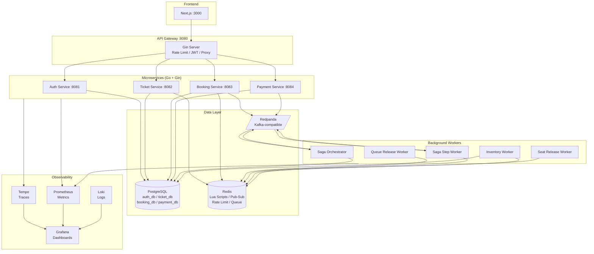
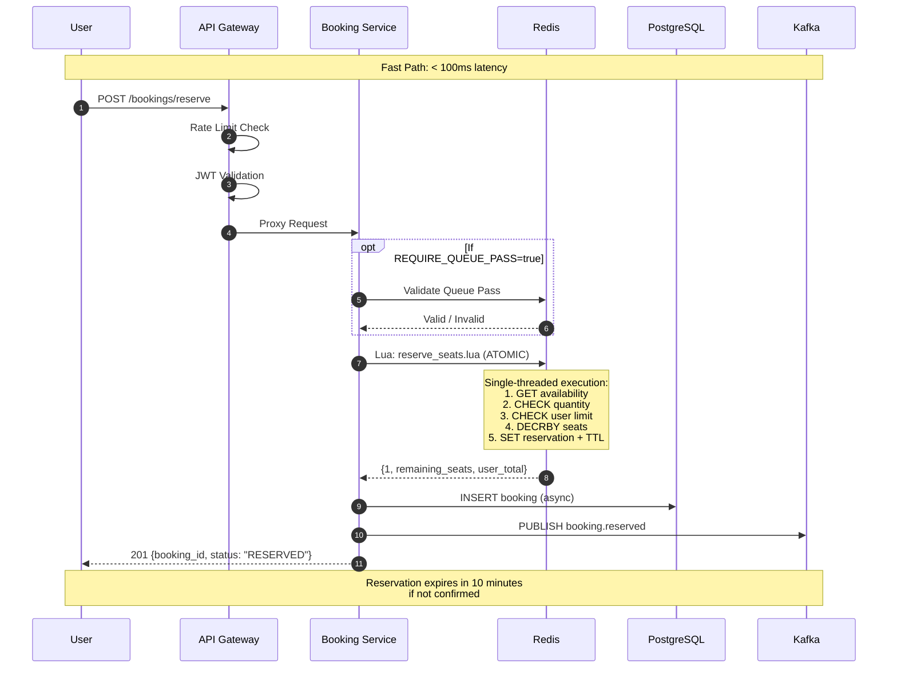
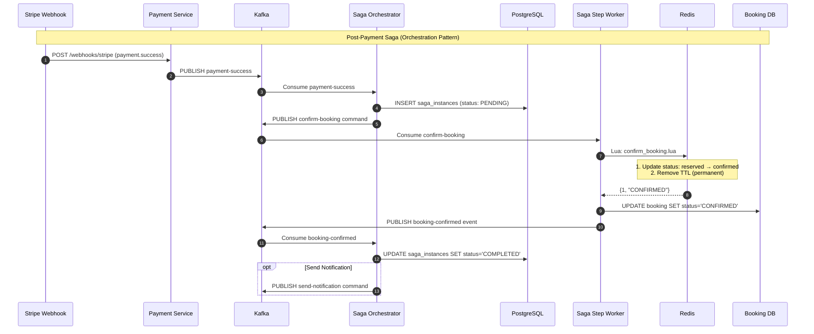
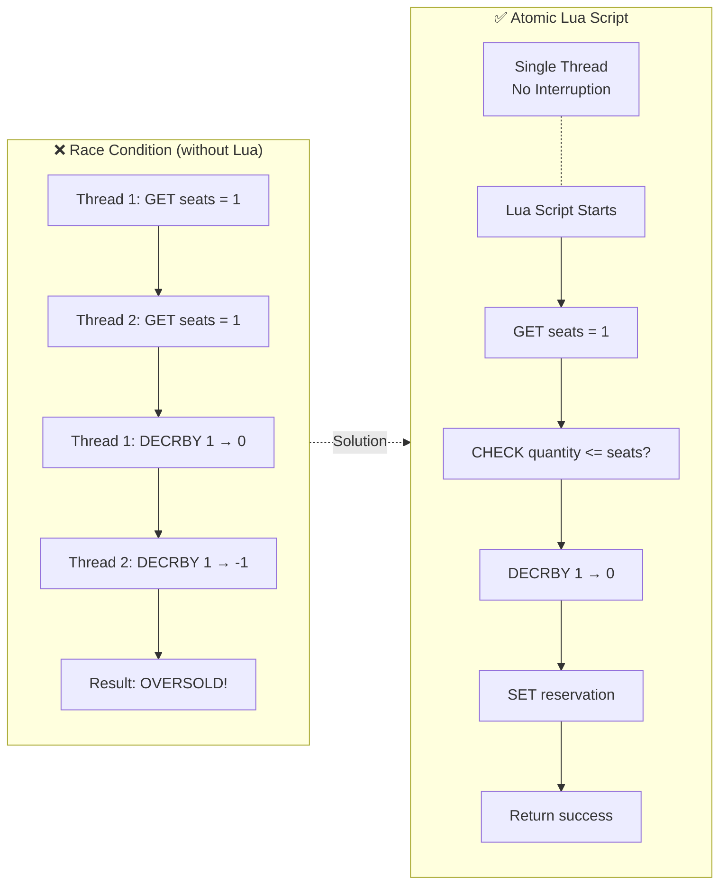

# Architecture Diagrams

Mermaid diagrams สำหรับระบบ Booking Rush - สร้างจาก codebase จริง

## วิธีดู Diagram

1. **GitHub/GitLab** - render อัตโนมัติ
2. **VS Code** - ติดตั้ง extension "Markdown Preview Mermaid Support"
3. **Online** - ไปที่ [mermaid.live](https://mermaid.live) แล้ว paste code
4. **Export PNG/SVG** - ใช้ mermaid.live แล้วกด export

---

## 1. Virtual Queue - Fair Access Control

### 1.1 Overview Flowchart



### 1.2 Sequence Diagram (ละเอียด)



### 1.3 Data Structures

| Key Pattern | Type | Description | TTL |
|-------------|------|-------------|-----|
| `queue:{event_id}` | Sorted Set | Waiting users, score = join timestamp | - |
| `queue:pass:{event_id}:{user_id}` | String | JWT queue pass | 5 min |
| `queue:config:{event_id}` | Hash | max_concurrent, pass_ttl | - |

### 1.4 Performance Comparison

| Method | Queries/sec | Efficiency |
|--------|-------------|------------|
| Polling (every 500ms) | 2,000,000 | ❌ High Load |
| Pub/Sub + SSE | 10,000 | ✅ Efficient |

---

## 2. Overall System Architecture



---

## 3. Fast Path - Seat Reservation



---

## 4. Post-Payment Saga



---

## 5. Redis Lua Scripts - Atomic Operations



### Lua Scripts Reference

| Script | File | Purpose |
|--------|------|---------|
| reserve_seats.lua | `scripts/lua/reserve_seats.lua` | Atomic seat reservation |
| confirm_booking.lua | `scripts/lua/confirm_booking.lua` | Mark confirmed, remove TTL |
| release_seats.lua | `scripts/lua/release_seats.lua` | Return seats to inventory |

---

## 6. Service Ports Reference

| Service | Port | Technology | Responsibility |
|---------|------|------------|----------------|
| Frontend | 3000 | Next.js | Web UI |
| API Gateway | 8080 | Go + Gin | Rate limit, JWT, Proxy |
| Auth Service | 8081 | Go + Gin | Authentication, JWT |
| Ticket Service | 8082 | Go + Gin | Events, Zones catalog |
| Booking Service | 8083 | Go + Gin | Reservations, Queue, Saga |
| Payment Service | 8084 | Go + Gin | Stripe integration |

---

## 7. Key File Locations

```
backend-booking/
├── main.go                                    # Entry point
├── cmd/
│   ├── queue-worker/main.go                   # Queue Release Worker
│   ├── saga-orchestrator/main.go              # Saga Orchestrator
│   ├── saga-step-worker/main.go               # Saga Step Worker
│   └── seat-release-worker/main.go            # Seat Release Worker
├── internal/
│   ├── handler/
│   │   ├── booking_handler.go                 # /bookings/* endpoints
│   │   └── queue_handler.go                   # /queue/* endpoints
│   ├── service/
│   │   ├── booking_service.go                 # Booking business logic
│   │   └── queue_service.go                   # Queue business logic
│   ├── repository/
│   │   ├── redis_reservation_repository.go   # Redis Lua scripts
│   │   └── redis_queue_repository.go         # Queue Redis operations
│   ├── worker/
│   │   └── queue_release_worker.go           # Worker implementation
│   └── saga/
│       └── booking_saga.go                    # Saga definition

scripts/lua/
├── reserve_seats.lua                          # Atomic reservation
├── confirm_booking.lua                        # Confirm after payment
└── release_seats.lua                          # Release expired
```
