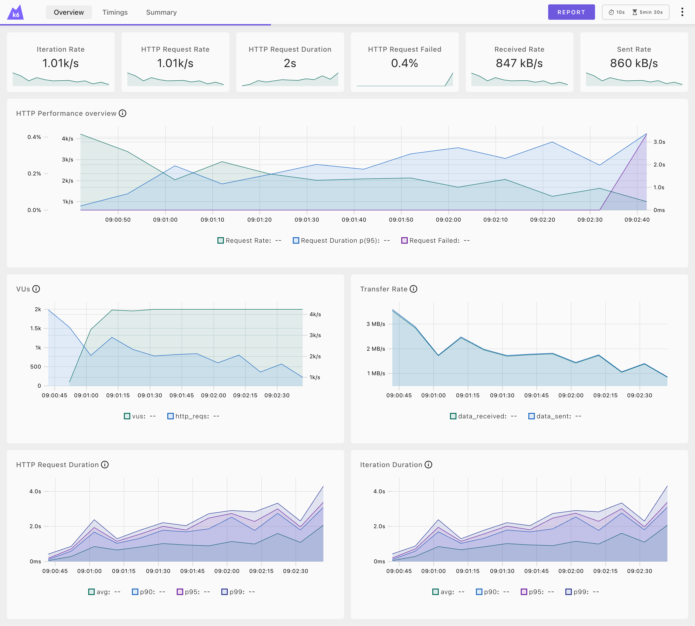

# อ่านกราฟ K6 Web Dashboard

## เปิด Web Dashboard

```bash
# รัน k6 พร้อม Web Dashboard
k6 run --out web-dashboard script.js

# หรือกำหนด port
k6 run --out web-dashboard=port:5665 script.js
```

เปิด browser ไปที่ `http://localhost:5665`

---

## ภาพรวม Dashboard



Dashboard แบ่งเป็น 3 ส่วนหลัก:
1. **Header Metrics** - ตัวเลขสรุปด้านบน
2. **HTTP Performance Overview** - กราฟหลักรวมทุกอย่าง
3. **Detail Charts** - กราฟย่อยแสดงรายละเอียด

---

## 1. Header Metrics (ตัวเลขสรุป)

ด้านบนสุดมี 6 ตัวเลขหลัก:

| Metric | ค่าในรูป | ความหมาย |
|--------|---------|----------|
| **Iteration Rate** | 1.01k/s | จำนวน iterations ที่ทำสำเร็จต่อวินาที |
| **HTTP Request Rate** | 1.01k/s | จำนวน HTTP requests ที่ส่งต่อวินาที |
| **HTTP Request Duration** | 2s | เวลาเฉลี่ยต่อ request |
| **HTTP Request Failed** | 0.4% | เปอร์เซ็นต์ที่ fail |
| **Received Rate** | 847 kB/s | ข้อมูลที่รับต่อวินาที |
| **Sent Rate** | 860 kB/s | ข้อมูลที่ส่งต่อวินาที |

### วิเคราะห์จากตัวเลข:
```
✅ Iteration Rate = HTTP Request Rate
   → ทุก iteration ส่ง 1 request (ปกติ)

⚠️ HTTP Request Duration = 2s
   → ช้ากว่าปกติ (ควรต่ำกว่า 500ms)

✅ HTTP Request Failed = 0.4%
   → ยอมรับได้ (< 5%)

📊 Received ≈ Sent
   → Request/Response ขนาดใกล้เคียงกัน
```

---

## 2. HTTP Performance Overview (กราฟหลัก)

กราฟใหญ่ด้านบนแสดง 3 metrics พร้อมกัน:

```
     0.4% │ 4k/s ─────────────────────────────────────── 3.0s
          │ 🟢                                           │
     0.2% │     🟢🟢🟢                     🔵🔵🔵🔵🔵🔵🔵 │ 2.0s
          │         🟢🟢🟢🟢              🔵🔵           │
     0.0% │ 1k/s      🟢🟢🟢🟢🟢🟢🟢🟢🟢               🟣🟣 │ 1.0s
          └──────────────────────────────────────────────┘
            09:00:50         09:01:30         09:02:30

          🟢 Request Rate     🔵 Request Duration p(95)    🟣 Request Failed
```

### สิ่งที่กราฟนี้บอก:

| เส้น | แกน | ความหมาย |
|------|-----|----------|
| 🟢 **Request Rate** (สีเขียว) | ซ้าย (k/s) | จำนวน requests ต่อวินาที |
| 🔵 **Request Duration p(95)** (สีฟ้า) | ขวา (ms/s) | 95% ของ requests เร็วกว่าค่านี้ |
| 🟣 **Request Failed** (สีม่วง) | ซ้าย (%) | เปอร์เซ็นต์ที่ fail |

### วิเคราะห์จากกราฟ:

```
ช่วงเวลา 09:00:50 - 09:01:10:
- Request Rate สูง (~4k/s)
- Duration ต่ำ (~1s)
→ Server ยังรับไหว

ช่วงเวลา 09:01:30 - 09:02:30:
- Request Rate ลดลง (~1.5k/s)
- Duration สูงขึ้น (~2-3s)
→ Server เริ่มช้าลง

ช่วงเวลา 09:02:30+:
- Request Failed เพิ่มขึ้น (สีม่วงโผล่)
→ Server เริ่มมีปัญหา
```

### Pattern ที่ควรระวัง:

| Pattern | สัญญาณ | แสดงว่า |
|---------|--------|---------|
| 🔵 ขึ้น + 🟢 ลง | Duration สูง + Rate ลด | Server ช้าลง |
| 🟣 โผล่ขึ้น | Failed % เพิ่ม | Server เริ่ม error |
| 🟢 ตก ทันที | Rate ดิ่ง | Server อาจ crash |
| 🔵 พุ่งสูง | Duration spike | มี slow query หรือ GC |

---

## 3. VUs Chart (กราฟ Virtual Users)

```
     VUs
      │
   2k │ 🟢🟢🟢🟢🟢🟢🟢🟢🟢🟢🟢🟢🟢🟢🟢🟢🟢🟢🟢    4k/s
      │ 🟢🟢                                    │
  1.5k│                                         │ 3k/s
      │   🔵🔵🔵🔵                               │
   1k │       🔵🔵🔵🔵🔵🔵🔵🔵🔵🔵🔵🔵🔵🔵🔵🔵🔵    │ 2k/s
      │                                         │
  500 │                                         │ 1k/s
      │
    0 └─────────────────────────────────────────┘
        09:00:45        09:01:30        09:02:30

      🟢 vus (จำนวน Virtual Users)
      🔵 http_reqs (Request Rate)
```

### สิ่งที่กราฟนี้บอก:

| เส้น | ความหมาย |
|------|----------|
| 🟢 **vus** | จำนวน Virtual Users ที่ active |
| 🔵 **http_reqs** | Rate ของ HTTP requests |

### วิเคราะห์:

```
VUs คงที่ (~2000) แต่ http_reqs ลดลง
→ แต่ละ VU ส่ง request ได้น้อยลง
→ เพราะต้องรอ response นานขึ้น

สูตร: RPS = VUs / avg_response_time
- 2000 VUs / 0.5s = 4000 RPS
- 2000 VUs / 2.0s = 1000 RPS ← เกิดขึ้นในกราฟ
```

---

## 4. Transfer Rate Chart (กราฟ Network)

```
     Rate
      │
  3MB/s│ 🟢
       │ 🟢🟢
  2MB/s│    🟢🟢🟢                           🟢🟢
       │        🟢🟢🟢🟢🟢🟢🟢🟢🟢🟢🟢🟢🟢🟢
  1MB/s│
       │    🔵🔵🔵🔵🔵🔵🔵🔵🔵🔵🔵🔵🔵🔵🔵🔵🔵🔵
       └─────────────────────────────────────────
         09:00:45        09:01:30        09:02:30

       🟢 data_received (ข้อมูลที่รับ)
       🔵 data_sent (ข้อมูลที่ส่ง)
```

### สิ่งที่กราฟนี้บอก:

| Metric | ความหมาย |
|--------|----------|
| **data_received** | Bandwidth ที่ใช้รับข้อมูลจาก server |
| **data_sent** | Bandwidth ที่ใช้ส่งข้อมูลไป server |

### เมื่อไหร่ควรดูกราฟนี้:

- ตรวจสอบว่า network เป็น bottleneck หรือไม่
- เปรียบเทียบขนาด request vs response
- ดู pattern ของ data transfer

---

## 5. HTTP Request Duration Chart (กราฟ Response Time)

```
     Duration
      │
   4s │                                    ⬜⬜⬜
      │                                 🟣🟣
      │              🟣🟣🟣🟣🟣🟣🟣🟣🟣🟣
   2s │           🔵🔵🔵🔵
      │     🟢🟢🟢🟢
      │  🟢🟢
   0s │🟢
      └─────────────────────────────────────────
        09:00:45        09:01:30        09:02:30

      🟢 avg (ค่าเฉลี่ย)
      🔵 p90 (90th percentile)
      🟣 p95 (95th percentile)
      ⬜ p99 (99th percentile)
```

### สิ่งที่กราฟนี้บอก:

| เส้น | ความหมาย | ใช้ดูอะไร |
|------|----------|----------|
| 🟢 **avg** | ค่าเฉลี่ย | ภาพรวมทั่วไป |
| 🔵 **p90** | 90% เร็วกว่านี้ | ประสบการณ์ส่วนใหญ่ |
| 🟣 **p95** | 95% เร็วกว่านี้ | มาตรฐานอุตสาหกรรม |
| ⬜ **p99** | 99% เร็วกว่านี้ | worst case (outliers) |

### วิเคราะห์:

```
ถ้า p99 สูงกว่า p95 มาก:
→ มี slow requests บางส่วน
→ อาจเกิดจาก GC pause, slow query, network hiccup

ถ้าทุกเส้นสูงขึ้นพร้อมกัน:
→ Server ช้าลงโดยรวม
→ อาจเกิดจาก resource exhaustion
```

---

## 6. Iteration Duration Chart

```
     Duration
      │
   4s │                                    ⬜⬜⬜
      │                                 🟣🟣
      │              🟣🟣🟣🟣🟣🟣🟣🟣🟣🟣
   2s │           🔵🔵🔵🔵
      │     🟢🟢🟢🟢
      │  🟢🟢
   0s │🟢
      └─────────────────────────────────────────

      🟢 avg   🔵 p90   🟣 p95   ⬜ p99
```

### ความแตกต่างจาก HTTP Request Duration:

| Metric | รวมอะไรบ้าง |
|--------|------------|
| **HTTP Request Duration** | เฉพาะ HTTP request |
| **Iteration Duration** | HTTP + sleep() + logic ทั้งหมดใน 1 รอบ |

```javascript
export default function() {
    http.get(url);           // ← รวมใน HTTP Duration
    sleep(1);                // ← รวมใน Iteration Duration เท่านั้น
    const data = process();  // ← รวมใน Iteration Duration เท่านั้น
}
```

---

## Tabs อื่นๆ ใน Dashboard

### Timings Tab
แสดงการแยกส่วนของ request timing:
- `blocked` - รอก่อนเริ่ม
- `connecting` - สร้าง connection
- `tls_handshaking` - TLS handshake
- `sending` - ส่ง request
- `waiting` - รอ response (TTFB)
- `receiving` - รับ response

### Summary Tab
แสดงสรุปตัวเลขทั้งหมด:
- Total requests
- Pass/Fail counts
- Percentile values
- Threshold results

---

## สรุป: อ่านกราฟอย่างไร

### 1. ดู Header ก่อน
```
✅ Request Rate สูงพอไหม?
✅ Duration ต่ำพอไหม?
✅ Failed % ต่ำพอไหม?
```

### 2. ดู HTTP Performance Overview
```
🟢 Request Rate ควรคงที่หรือเพิ่มขึ้น
🔵 Duration ควรต่ำและคงที่
🟣 Failed ไม่ควรมี (หรือมีน้อยมาก)
```

### 3. ดู Correlation
```
VUs คงที่ แต่ Rate ลด → Server ช้าลง
Duration พุ่ง + Failed เพิ่ม → Server ล้มเหลว
p99 >> p95 → มี outliers
```

### 4. ดู Pattern
```
ค่อยๆ แย่ลง → Resource exhaustion
แย่ทันที → Breaking point
กระโดดๆ → Unstable, GC, Network
```

---

## อ่านต่อ

- [06 - วิเคราะห์ผลลัพธ์](./06-analyze-results.md)
- [07 - Best Practices](./07-best-practices.md)
